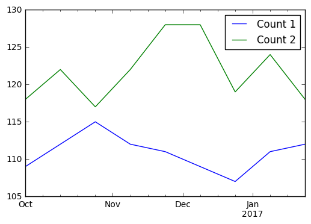

```python
import pandas as pd
import numpy as np

```


```python
### Timestamp
```


```python
pd.Timestamp('9/1/2016 10:05AM')
```


    Timestamp('2016-09-01 10:05:00')


```python
### Period
```


```python
pd.Period('1/2016')
```


    Period('2016-01', 'M')


```python
pd.Period('3/5/2016')
```


    Period('2016-03-05', 'D')


```python
### DatetimeIndex

```


```python
t1 = pd.Series(list('abc'), [pd.Timestamp('2016-09-01'), pd.Timestamp('2016-09-02'), pd.Timestamp('2016-09-03')])
t1
```


    2016-09-01    a
    2016-09-02    b
    2016-09-03    c
    dtype: object


```python
type(t1.index)
```


    pandas.tseries.index.DatetimeIndex


```python
t2 = pd.Series(list('def'), [pd.Period('2016-09'), pd.Period('2016-10'), pd.Period('2016-11')])
t2
```


    2016-09    d
    2016-10    e
    2016-11    f
    Freq: M, dtype: object


```python
### Converting to Datetime
```


```python
d1 = ['2 June 2013', 'Aug 29, 2014', '2015-06-26', '7/12/16']
ts3 = pd.DataFrame(np.random.randint(10, 100, (4,2)), index=d1, columns=list('ab'))
ts3
```


<div>
<table border="1" class="dataframe">
  <thead>
    <tr style="text-align: right;">
      <th></th>
      <th>a</th>
      <th>b</th>
    </tr>
  </thead>
  <tbody>
    <tr>
      <th>2 June 2013</th>
      <td>73</td>
      <td>49</td>
    </tr>
    <tr>
      <th>Aug 29, 2014</th>
      <td>32</td>
      <td>30</td>
    </tr>
    <tr>
      <th>2015-06-26</th>
      <td>36</td>
      <td>42</td>
    </tr>
    <tr>
      <th>7/12/16</th>
      <td>88</td>
      <td>72</td>
    </tr>
  </tbody>
</table>
</div>


```python
ts3.index = pd.to_datetime(ts3.index)
ts3

```


<div>
<table border="1" class="dataframe">
  <thead>
    <tr style="text-align: right;">
      <th></th>
      <th>a</th>
      <th>b</th>
    </tr>
  </thead>
  <tbody>
    <tr>
      <th>2013-06-02</th>
      <td>73</td>
      <td>49</td>
    </tr>
    <tr>
      <th>2014-08-29</th>
      <td>32</td>
      <td>30</td>
    </tr>
    <tr>
      <th>2015-06-26</th>
      <td>36</td>
      <td>42</td>
    </tr>
    <tr>
      <th>2016-07-12</th>
      <td>88</td>
      <td>72</td>
    </tr>
  </tbody>
</table>
</div>


```python
pd.to_datetime('4.7.12', dayfirst=True)
```


    Timestamp('2012-07-04 00:00:00')


```python
### Timedeltas
```


```python
pd.Timestamp('9/3/2016')-pd.Timestamp('9/1/2016')

```


    Timedelta('2 days 00:00:00')


```python
pd.Timestamp('9/2/2016 8:10AM') + pd.Timedelta('12D 3H')
```


    Timestamp('2016-09-14 11:10:00')


```python
### Working with Dates in a DataFrame
```


```python
dates = pd.date_range('10-01-2016', periods=9, freq='2W-SUN')
dates
```


    DatetimeIndex(['2016-10-02', '2016-10-16', '2016-10-30', '2016-11-13',
                   '2016-11-27', '2016-12-11', '2016-12-25', '2017-01-08',
                   '2017-01-22'],
                  dtype='datetime64[ns]', freq='2W-SUN')


```python
df = pd.DataFrame({'Count 1': 100 + np.random.randint(-5, 10, 9).cumsum(),
                  'Count 2': 120 + np.random.randint(-5, 10, 9)}, index=dates)
df
```


<div>
<table border="1" class="dataframe">
  <thead>
    <tr style="text-align: right;">
      <th></th>
      <th>Count 1</th>
      <th>Count 2</th>
    </tr>
  </thead>
  <tbody>
    <tr>
      <th>2016-10-02</th>
      <td>109</td>
      <td>118</td>
    </tr>
    <tr>
      <th>2016-10-16</th>
      <td>112</td>
      <td>122</td>
    </tr>
    <tr>
      <th>2016-10-30</th>
      <td>115</td>
      <td>117</td>
    </tr>
    <tr>
      <th>2016-11-13</th>
      <td>112</td>
      <td>122</td>
    </tr>
    <tr>
      <th>2016-11-27</th>
      <td>111</td>
      <td>128</td>
    </tr>
    <tr>
      <th>2016-12-11</th>
      <td>109</td>
      <td>128</td>
    </tr>
    <tr>
      <th>2016-12-25</th>
      <td>107</td>
      <td>119</td>
    </tr>
    <tr>
      <th>2017-01-08</th>
      <td>111</td>
      <td>124</td>
    </tr>
    <tr>
      <th>2017-01-22</th>
      <td>112</td>
      <td>118</td>
    </tr>
  </tbody>
</table>
</div>


```python
df.index.weekday_name

```


    array(['Sunday', 'Sunday', 'Sunday', 'Sunday', 'Sunday', 'Sunday',
           'Sunday', 'Sunday', 'Sunday'], dtype=object)


```python
df.diff()

```


<div>
<table border="1" class="dataframe">
  <thead>
    <tr style="text-align: right;">
      <th></th>
      <th>Count 1</th>
      <th>Count 2</th>
    </tr>
  </thead>
  <tbody>
    <tr>
      <th>2016-10-02</th>
      <td>NaN</td>
      <td>NaN</td>
    </tr>
    <tr>
      <th>2016-10-16</th>
      <td>3.0</td>
      <td>4.0</td>
    </tr>
    <tr>
      <th>2016-10-30</th>
      <td>3.0</td>
      <td>-5.0</td>
    </tr>
    <tr>
      <th>2016-11-13</th>
      <td>-3.0</td>
      <td>5.0</td>
    </tr>
    <tr>
      <th>2016-11-27</th>
      <td>-1.0</td>
      <td>6.0</td>
    </tr>
    <tr>
      <th>2016-12-11</th>
      <td>-2.0</td>
      <td>0.0</td>
    </tr>
    <tr>
      <th>2016-12-25</th>
      <td>-2.0</td>
      <td>-9.0</td>
    </tr>
    <tr>
      <th>2017-01-08</th>
      <td>4.0</td>
      <td>5.0</td>
    </tr>
    <tr>
      <th>2017-01-22</th>
      <td>1.0</td>
      <td>-6.0</td>
    </tr>
  </tbody>
</table>
</div>


```python
df.resample('M').mean()
```


<div>
<table border="1" class="dataframe">
  <thead>
    <tr style="text-align: right;">
      <th></th>
      <th>Count 1</th>
      <th>Count 2</th>
    </tr>
  </thead>
  <tbody>
    <tr>
      <th>2016-10-31</th>
      <td>112.0</td>
      <td>119.0</td>
    </tr>
    <tr>
      <th>2016-11-30</th>
      <td>111.5</td>
      <td>125.0</td>
    </tr>
    <tr>
      <th>2016-12-31</th>
      <td>108.0</td>
      <td>123.5</td>
    </tr>
    <tr>
      <th>2017-01-31</th>
      <td>111.5</td>
      <td>121.0</td>
    </tr>
  </tbody>
</table>
</div>


```python
df['2017']
```


<div>
<table border="1" class="dataframe">
  <thead>
    <tr style="text-align: right;">
      <th></th>
      <th>Count 1</th>
      <th>Count 2</th>
    </tr>
  </thead>
  <tbody>
    <tr>
      <th>2017-01-08</th>
      <td>111</td>
      <td>124</td>
    </tr>
    <tr>
      <th>2017-01-22</th>
      <td>112</td>
      <td>118</td>
    </tr>
  </tbody>
</table>
</div>


```python
df['2016-12']
```


<div>
<table border="1" class="dataframe">
  <thead>
    <tr style="text-align: right;">
      <th></th>
      <th>Count 1</th>
      <th>Count 2</th>
    </tr>
  </thead>
  <tbody>
    <tr>
      <th>2016-12-11</th>
      <td>109</td>
      <td>128</td>
    </tr>
    <tr>
      <th>2016-12-25</th>
      <td>107</td>
      <td>119</td>
    </tr>
  </tbody>
</table>
</div>


```python
df['2016-12':]
```


<div>
<table border="1" class="dataframe">
  <thead>
    <tr style="text-align: right;">
      <th></th>
      <th>Count 1</th>
      <th>Count 2</th>
    </tr>
  </thead>
  <tbody>
    <tr>
      <th>2016-12-11</th>
      <td>109</td>
      <td>128</td>
    </tr>
    <tr>
      <th>2016-12-25</th>
      <td>107</td>
      <td>119</td>
    </tr>
    <tr>
      <th>2017-01-08</th>
      <td>111</td>
      <td>124</td>
    </tr>
    <tr>
      <th>2017-01-22</th>
      <td>112</td>
      <td>118</td>
    </tr>
  </tbody>
</table>
</div>


```python
# forward fill fills in missing values
df.asfreq('W', method= 'ffill')
```


<div>
<table border="1" class="dataframe">
  <thead>
    <tr style="text-align: right;">
      <th></th>
      <th>Count 1</th>
      <th>Count 2</th>
    </tr>
  </thead>
  <tbody>
    <tr>
      <th>2016-10-02</th>
      <td>109</td>
      <td>118</td>
    </tr>
    <tr>
      <th>2016-10-09</th>
      <td>109</td>
      <td>118</td>
    </tr>
    <tr>
      <th>2016-10-16</th>
      <td>112</td>
      <td>122</td>
    </tr>
    <tr>
      <th>2016-10-23</th>
      <td>112</td>
      <td>122</td>
    </tr>
    <tr>
      <th>2016-10-30</th>
      <td>115</td>
      <td>117</td>
    </tr>
    <tr>
      <th>2016-11-06</th>
      <td>115</td>
      <td>117</td>
    </tr>
    <tr>
      <th>2016-11-13</th>
      <td>112</td>
      <td>122</td>
    </tr>
    <tr>
      <th>2016-11-20</th>
      <td>112</td>
      <td>122</td>
    </tr>
    <tr>
      <th>2016-11-27</th>
      <td>111</td>
      <td>128</td>
    </tr>
    <tr>
      <th>2016-12-04</th>
      <td>111</td>
      <td>128</td>
    </tr>
    <tr>
      <th>2016-12-11</th>
      <td>109</td>
      <td>128</td>
    </tr>
    <tr>
      <th>2016-12-18</th>
      <td>109</td>
      <td>128</td>
    </tr>
    <tr>
      <th>2016-12-25</th>
      <td>107</td>
      <td>119</td>
    </tr>
    <tr>
      <th>2017-01-01</th>
      <td>107</td>
      <td>119</td>
    </tr>
    <tr>
      <th>2017-01-08</th>
      <td>111</td>
      <td>124</td>
    </tr>
    <tr>
      <th>2017-01-15</th>
      <td>111</td>
      <td>124</td>
    </tr>
    <tr>
      <th>2017-01-22</th>
      <td>112</td>
      <td>118</td>
    </tr>
  </tbody>
</table>
</div>


```python
import matplotlib.pyplot as plt
%matplotlib inline
df.plot()
```

    /opt/conda/lib/python3.5/site-packages/matplotlib/font_manager.py:273: UserWarning: Matplotlib is building the font cache using fc-list. This may take a moment.
      warnings.warn('Matplotlib is building the font cache using fc-list. This may take a moment.')
    /opt/conda/lib/python3.5/site-packages/matplotlib/font_manager.py:273: UserWarning: Matplotlib is building the font cache using fc-list. This may take a moment.
      warnings.warn('Matplotlib is building the font cache using fc-list. This may take a moment.')


    <matplotlib.axes._subplots.AxesSubplot at 0x7f29c3168b00>





```python

```
